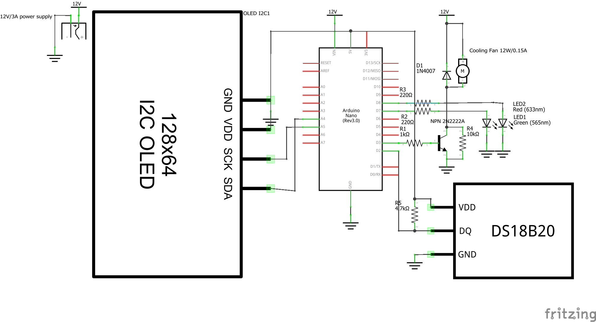

# Smart Fan with Temperature Control / Умный вентилятор с датчиком температуры

[English](#english) | [Русский](#русский)

## English 
- Abstract
- Features  
- Schematics
- Installation

---

## Русский 
## Содержание
- [Описание](#описание-проекта)
- [Функциональность](#функциональность)
- [Схемы](#схемы)
- [Установка](#установка)
- [Технологии_и_инструменты](#технологии-и-инструменты)
- [Установка_и_запуск](#установка-и-запуск)
- [Содержание_проекта](#cодержание-проекта)

## Описание проекта 
Автоматическая система управления вентилятором на основе измерительных показателей датчика температуры

## Функциональность 
- Автоматическое включение при >30°C
- Автоматическое выключение при <28°C
- Индикация состояния c помощью LED, Дисплея

## Схемы 
Ниже представлена принципиальная схема подключения умного вентилятора на Arduino:

## Установка 

## Технологии и инструменты 

## Установка и запуск 

## Содержание проекта 
|№|Компонент|Кол-во|Назначение|
|-|:--------|:-----|:---------|
|1|Блок питания на 12V/3A|х1|Питание всей системы|
|2|Датчик температуры DS18B20|х1|Измерение температуры|
|3|Диод 1N4007|х1|Служит "амортизатором" для транзистора|
|4|Дисплей LCD1602 I2C|х1|Индикация|
|5|Компьютерный кулер на 12Вт/0.15А|х1|Вентилятор, источник потребления|
|6|Резистор на 220 Ом|х2|Для LED|
|7|Резистор на 1 кОм|х1|Для базы транзистора|
|8|Резистор на 4.7кОм|х1|Подтяжка DATA DS18B20|
|9|Резистор на 10кОм|х1|Подтяжка коллектора к эмиттеру|
|10|Arduino Nano|х1|Контроллер|
|11|LED|х2|Индикация состояния|
|12|NPN-транзистор 2N2222А|х1|Управление кулером|

